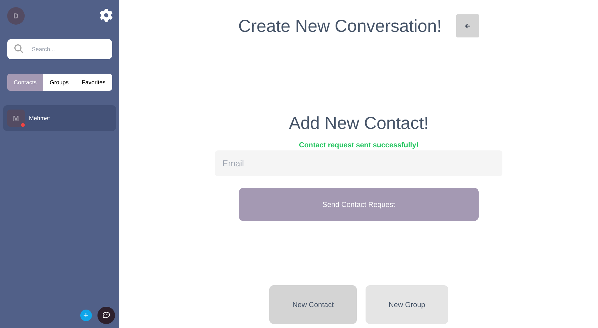
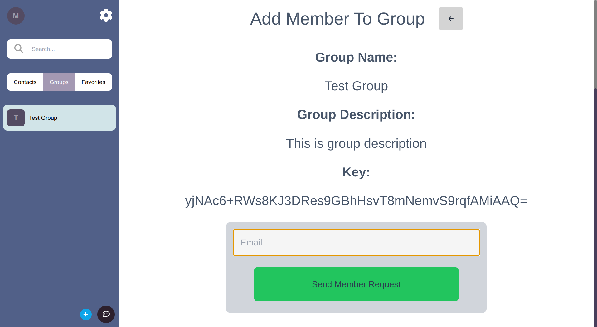
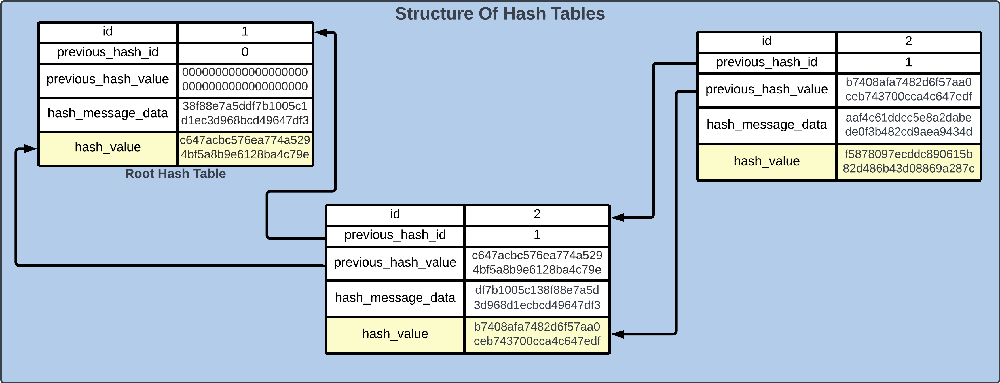
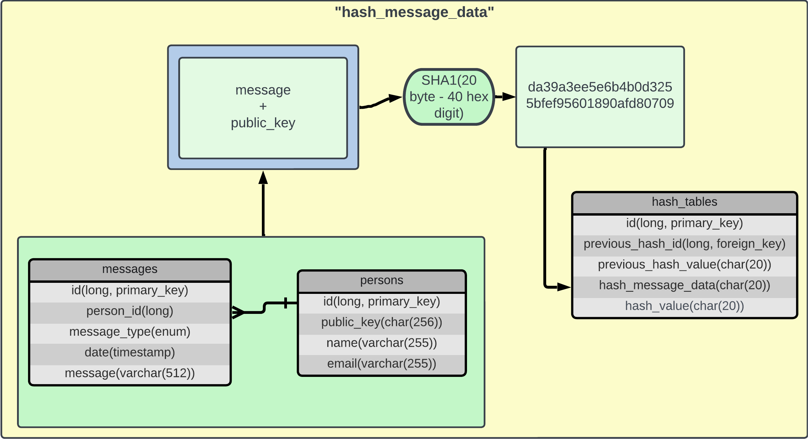

# Bowl Desktop
Desktop client of Bowl Chat.
## Overview
### Log In

### Add New Contact

### Create New Group

### Add Member To Group

### Notifications

### Chat

### Group Info

### Settings

### Generate New Key Pair

## General Architecture

## ER Diagrams

## Structure Of Hash Tables

## Calculation Of "hash_message_data"

## Calculation Of "hash_value"


## Project setup
```
npm install
```

### Compiles and hot-reloads for development
In electron window
```
npm run electron:serve
```

### Build for production
```
npm run electroun:build
```

### Lints and fixes files
```
npm run lint
```
